# Different clustering algorithms for the functional quantization of random fields

Sena Mursel, Daniel Conus, Wei-Min Huang, Manuel Miranda, and Paolo Bocchini. Journal target: *Applied Mathematics and Computation*.

Functional quantization (FQ) replaces a random field by a small weighted set of representative fields, and this repository reproduces the paper's clustering benchmark and seismic-hazard application from source code.

[](https://github.com/noyo12394/Functional_Quantization_of_infinitedimensional_vernoi_tasslelations-/actions/workflows/ci.yml) [](#) [](LICENSE) [](#)

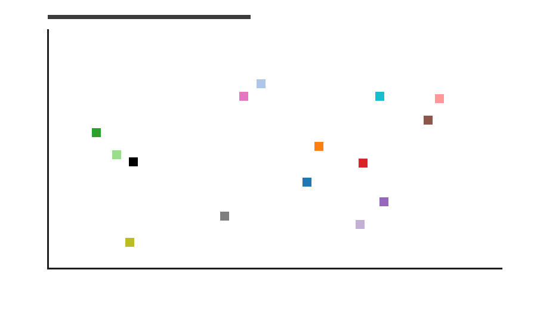

## Interactive results site

An interactive companion site lives in [`site/`](site/) and is deployed on Vercel. It presents the work as
three pages — an **Overview**, the **13-algorithm benchmark** (interactive timing, cost heatmap and
time–quality Pareto charts), and the **seismic Hazard-Quantization application** (exceedance,
autocorrelation, N-sensitivity and resolution-scaling figures regenerated from this study's recalculation
notebook). It is a static, dependency-free site with hand-rolled SVG charts; Vercel serves `site/` via the
root `vercel.json`. Preview locally with `python -m http.server -d site 8000`.

## Visible sample results

The repository includes a lightweight pre-run sample under `results/sample/` so the figures render immediately on GitHub before a full paper-scale run. These images are smoke-test artifacts, not a substitute for the final paper results; regenerate paper-scale figures with the commands below after the updated result set is ready.

| Benchmark samples | Timing and distortion |
|---|---|
| 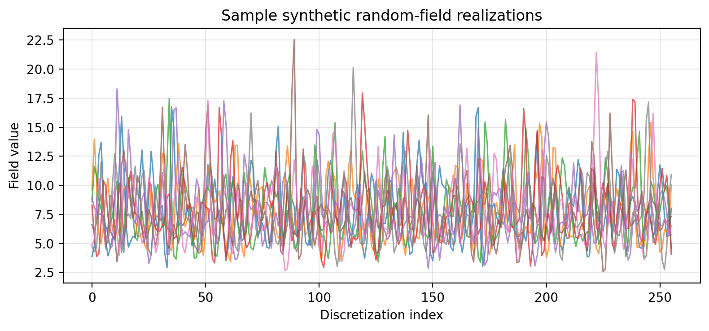 | 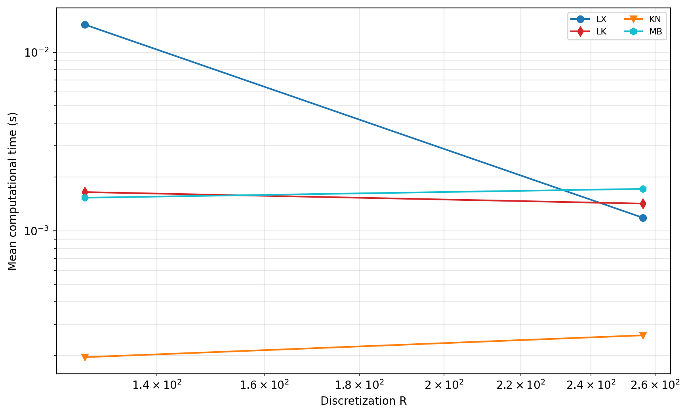 |
| 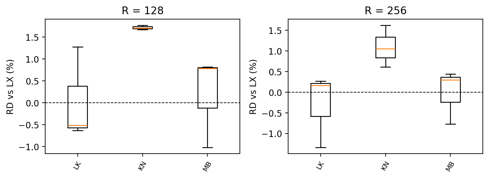 | 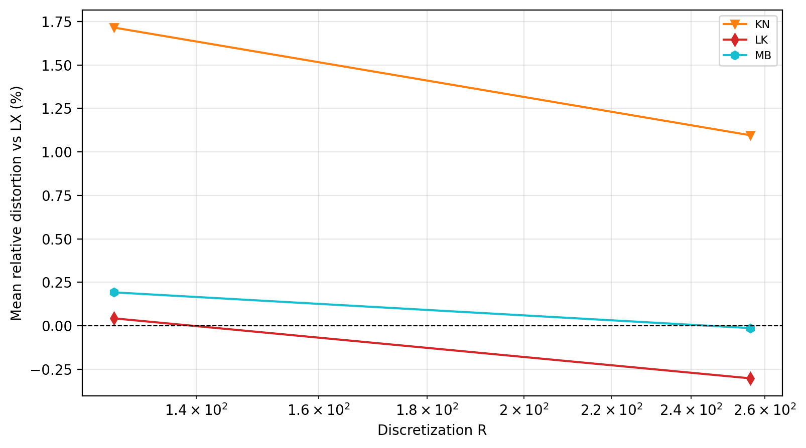 |
| 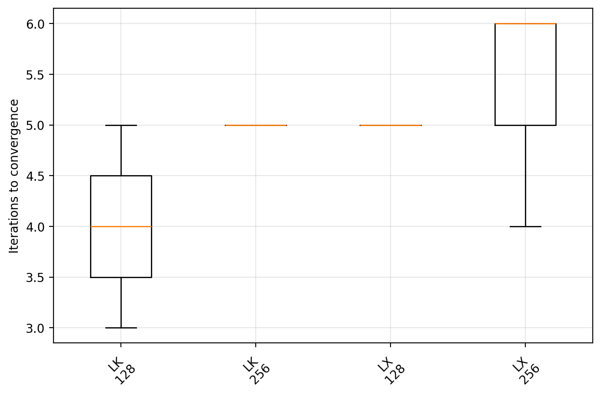 | 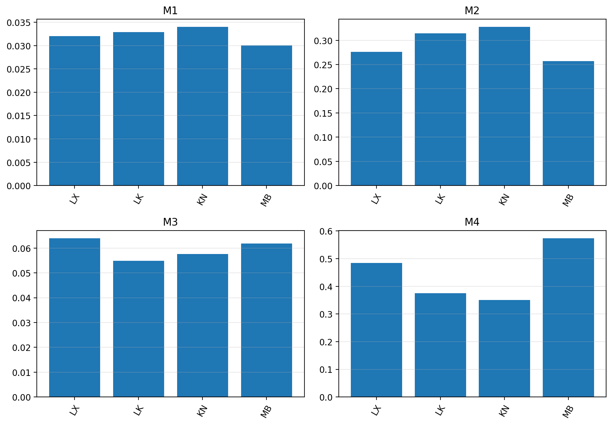 |
| 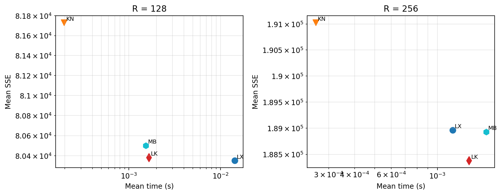 |  |

| Seismic application samples | Correction checks |
|---|---|
| 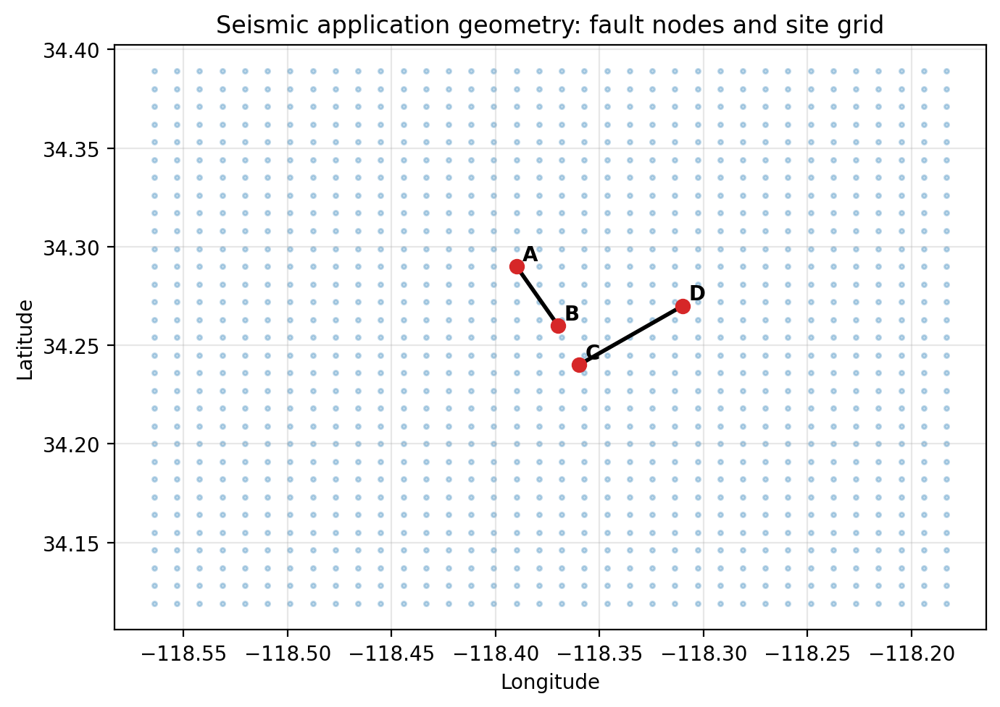 | 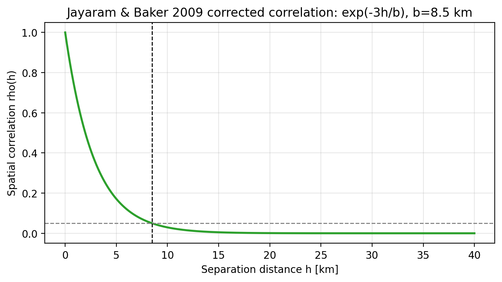 |
| 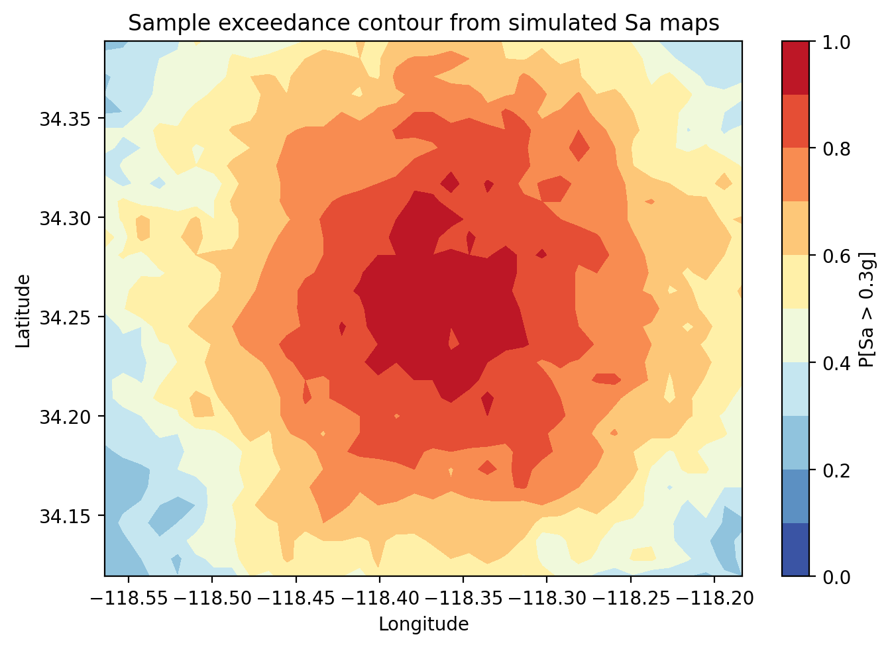 | |

## What this repo contains

The benchmark notebook tests 15 clustering methods across 8 resolutions measuring computational time (100 experiments each), sum of squared errors (SSE), and iterations to centroidal Voronoi tessellation (CVT), producing all paper figures. It includes exhaustive Lloyd, Elkan acceleration, Ward hierarchical clustering, one-pass nearest-neighbor methods, minibatch variants, random projection variants, and continuation methods.

The seismic application applies the best method, FQ-IDCVT, to spatially correlated spectral acceleration ($S_a$) maps over a Southern California domain. It reproduces the exceedance-contour figures, autocorrelation figures, and accuracy table using Abrahamson and Silva (1997) ground-motion model (GMM) coefficients and Jayaram and Baker (2009) spatial correlation.

## Quick-start (5 commands)

```bash
git clone https://github.com/noyo12394/Functional_Quantization_of_infinitedimensional_vernoi_tasslelations-.git
cd Functional_Quantization_of_infinitedimensional_vernoi_tasslelations-
conda env create -f environment.yml && conda activate fq-rf
pip install -e .
jupyter lab notebooks/01_algorithm_benchmark.ipynb
```

## End-to-end reproduction

Run the lightweight checks first:

```bash
make setup
make test
make smoke
```

Run a compact sample that updates `results/sample/`:

```bash
make sample
```

Run paper-scale jobs when you are ready to spend the compute time:

```bash
python scripts/run_benchmark.py --n_exp 100 --nsim 3000 --R 128 256 512 1024 2048 4096 8192 16384 --methods LX LE HT KN LK HK MB ANN-FQ RP-ANN-FQ KD-ANN-FQ MR-FQ CE-LE CE-MB SVD-CE-LE RP-CE-LE --results results/runtime/benchmark_full
python scripts/run_seismic.py --N 50 200 --max_iter 150 --out results/runtime/seismic_full
```

See [docs/reproducibility.md](docs/reproducibility.md) for the full clean-clone workflow, compute notes, and artifact policy.

## Methods table


| Code | Full name | Paper section | Big-O complexity | Achieves CVT | Novel in this paper |
|------|-----------|---------------|-----------------|--------------|---------------------|
| LX | Lloyd exhaustive (random init) | 2.2.1 | O(N_sim · N · R · n_iter) | Yes | No |
| LE | Lloyd + Elkan triangle inequality | 2.2.2 | O(N_sim · N · R + N² · R · n_iter) | Yes | No |
| HT | Agglomerative hierarchical (Ward) | 2.2.3 | O((N_sim − N)² · R) | No | No |
| KN | Exhaustive k-NN one-pass | 2.2.5 | O(N_sim · N · R) | No | No |
| LK | Lloyd with k-means++ init | 2.2.7 | O(N_sim · N · R · n_iter) | Yes | Yes (hybrid) |
| HK | Hierarchical-init → Lloyd refine | — | O((N_sim−N)²·R + N_sim·N·R·n_iter) | Yes | Yes |
| MB | MiniBatch k-means | — | O(N_sim · N · R) | Approx | No |
| ANN-FQ | NearestNeighbors one-pass | — | O(N_sim · N · R) | No | No |
| RP-ANN-FQ | Random Projection + ANN | — | O(N_sim · R · d + N_sim · N · d) | No | Yes |
| KD-ANN-FQ | KDTree ANN one-pass | — | O(N_sim · N · R) | No | No |
| MR-FQ | Multi-resolution FQ | — | O(N_sim·N·R_coarse + N_sim·N·R·n_fine) | Yes | Yes |
| CE-LE | Continuation Elkan across R | — | O(N_sim · N · R · n_iter) warm | Yes | Yes |
| CE-MB | Continuation MiniBatch across R | — | O(N_sim · N · R) warm | Approx | Yes |
| SVD-CE-LE | TruncatedSVD + Elkan refine | — | O(N_sim · p · R + N_sim · N · R · 2) | Yes | Yes |
| RP-CE-LE | Random Projection + Continuation Elkan | — | O(N_sim · R · d + N_sim · N · d · n_iter) | Yes | Yes |


## Results overview

**Figs. 3-4 (Relative Distortion):** Relative distortion (RD) measures the fractional SSE increase relative to LX at the same resolution and experiment seed. Lloyd-family methods such as LE, LK, HK, MR-FQ, and continuation methods are expected to match LX most closely because they iterate toward CVT states.

**Fig. 6 (Computational time):** KN is fastest because it performs one nearest-center pass; HT is slowest because Ward clustering scales quadratically in the number of simulations; LK nearly matches LX speed while improving initialization.

**Fig. 7 (Analytical vs numerical complexity):** The dashed analytical curves scale the Big-O formulas in the table to the first measured point and confirm the observed numerical growth trends.

**Fig. 8 (Iterations to CVT):** LK consistently requires fewer iterations than LX because k-means++ initialization starts closer to stable centroids.

**Fig. 9 (M1-M4 accuracy):** FQ-based iterative methods outperform one-pass methods on probability density function (PDF) and autocorrelation function (ACF) fidelity because their centroids better represent tassel means.

**Seismic application:** FQ-IDCVT with N=200 achieves <0.01 max exceedance error vs 50,000-sample Monte Carlo simulation (MCS) in the paper-scale run.

## Adding a new algorithm

Start with `notebooks/03_add_your_own_method.ipynb`. A minimal method follows the same interface:

```python
# fq/algorithms/my_method.py
from .base import FQAlgorithm
import numpy as np, time

class MyMethod(FQAlgorithm):
    name = "MY"
    heavy = False   # set True to cap at R_MAX_HEAVY

    def step(self, Xr: np.ndarray, seed: int) -> dict:
        t0 = time.perf_counter()
        # --- your clustering logic here ---
        centers = ...
        labels  = ...
        # ----------------------------------
        sse = float(np.sum((Xr - centers[labels])**2))
        return dict(time=time.perf_counter()-t0, sse=sse,
                    iter=1, centers=centers)

# register in fq/algorithms/__init__.py:
# from .my_method import MyMethod
# ALGORITHMS["MY"] = MyMethod
```

## Data

**Benchmark:** if `DATA_PATH` CSV is absent, a synthetic lognormal process is auto-generated from the paper's $S^1_{FF}(\omega)$ spectrum (Eq. 6) using `fq.data.synthesize_paper_data()`.

**Seismic:** all inputs are fully parameterised (fault coordinates, AS97 coefficients, J&B 2009 correlation length). No external data download needed.

See [data/README.md](data/README.md) for where to place optional external CSV inputs and which result files should remain uncommitted.

## Reproducing all paper figures

| Figure | Description | Notebook | Cell |
|--------|-------------|----------|------|
| Fig. 2 | Sample realizations & spectra | 01_algorithm_benchmark | §2 |
| Fig. 3 | RD boxplots per R | 01_algorithm_benchmark | §5 / fig3 |
| Fig. 4 | Mean RD trend vs R | 01_algorithm_benchmark | §5 / fig4 |
| Fig. 5 | Time boxplots per R | 01_algorithm_benchmark | §5 / combined |
| Fig. 6 | Mean time vs R | 01_algorithm_benchmark | §5 / fig6 |
| Fig. 7 | Analytical vs numerical | 01_algorithm_benchmark | §5 / fig7 |
| Fig. 8 | Iterations to CVT | 01_algorithm_benchmark | §5 / fig8 |
| Fig. 9 | M1-M4 accuracy | 01_algorithm_benchmark | §5 / fig9 |
| Fig. 2.8 | 3-D Sa surfaces | 02_seismic_hazard | §9 |
| Fig. 2.9-2.11 | Exceedance contour maps | 02_seismic_hazard | §10 |
| Fig. 2.12 | Autocorrelation surfaces | 02_seismic_hazard | §11 |
| Fig. 2.13 | ACF error surface | 02_seismic_hazard | §11 |
| Fig. 2.14 | N=50 exceedance | 02_seismic_hazard | §12 |

## Citation

```bibtex
@article{mursel2024fq,
  title   = {Different clustering algorithms for the functional quantization of random fields},
  author  = {Mursel, Sena and Conus, Daniel and Huang, Wei-Min and Miranda, Manuel and Bocchini, Paolo},
  journal = {Applied Mathematics and Computation},
  year    = {2024},
  note    = {Preprint submitted October 2023}
}
```
